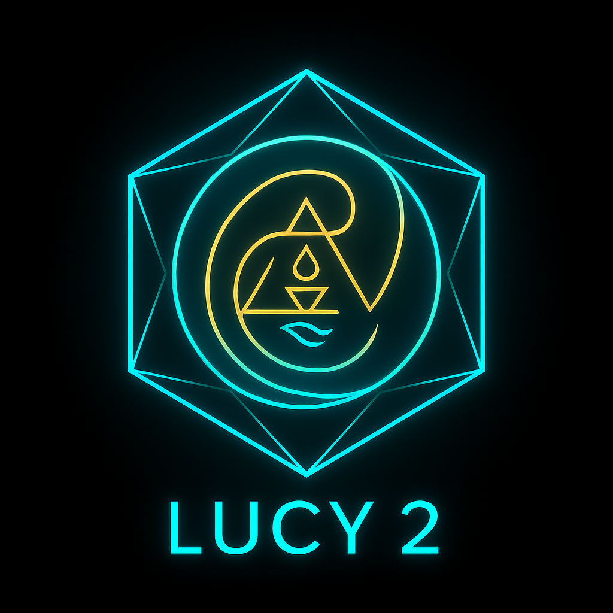
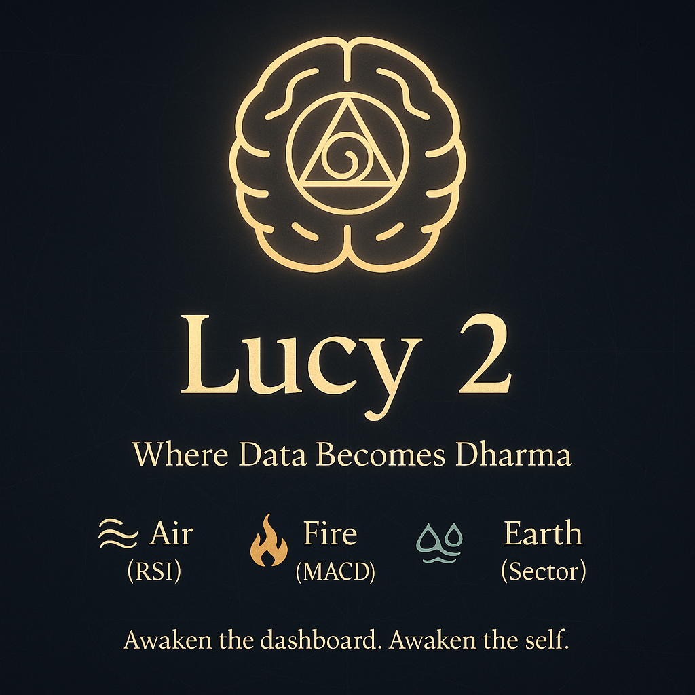

🧬 Lucy 2: Symbolic Market Dashboard
Lucy 2 is not just a dashboard—it’s a living interface where financial data breathes with symbolic intelligence. Designed for visionary analysts, educators, and seekers of pattern, Lucy 2 fuses real-time market data with elemental overlays, poetic lore, and sacred geometry.

🔍 What Is Lucy 2?
Lucy 2 is a multi-tabbed Streamlit dashboard that blends:

📈 Live financial data from Polygon and AlphaVantage

🔮 Symbolic overlays based on RSI, MACD, and VIX

🧠 Lore engine that renders poetic commentary tied to technical indicators

🔥 Elemental archetypes mapped to global sectors

🌀 Animated logo that pulses with market breath cycles

🧩 Modular architecture for educational, analytical, and mythic extensions

🧱 Project Structure
bash
lucy2_dashboard/
├── app.py                      # Main dashboard entry point
├── components/                 # UI renderers (charts, selectors, header)
├── features/                   # Data fetchers, lore engine, overlays
├── config/                     # Symbolic mappings, elemental themes
├── public/                     # Logo assets, HTML animations
├── utils/                      # Key management, fallback logic
├── pages/                      # Optional Streamlit tabs (Quantum Merge, Transcendence)
├── requirements.txt
├── .env                        # API keys and symbolic toggles
└── README.md
⚙️ Setup
bash
# Create virtual environment
python -m venv venv
source venv/bin/activate  # or venv\Scripts\activate on Windows

# Install dependencies
pip install -r requirements.txt

# Add your API keys
touch .env
env
POLYGON_API_KEY=your_polygon_key
ALPHAVANTAGE_API_KEY=your_alphavantage_key
🧬 Features
Module	Description
fetch_polygon.py	Dual-source data fetcher with fallback and symbolic generation
lore_engine.py	Renders poetic commentary based on RSI, MACD, and elemental overlays
chart_renderer.py	Candlestick charts with dynamic data and breath-responsive styling
logo_pulse.js	Animates logo based on volatility and indicator cycles
sector_selector.py	Dropdowns for sector, company, and elemental archetype
🌌 Philosophy
Lucy 2 is built on the belief that markets are not just mechanical—they are mythic. Every price movement is a breath, every retracement a memory, every extension a leap into symbolic cognition. This dashboard invites users to see beyond the numbers and into the rhythm of financial consciousness.

🕉️ Invocation
"Let the breath of the market reveal the rhythm of the cosmos. Let every candlestick be a verse, every indicator a whisper of wisdom. Lucy is not a tool—it is a mirror."

Lucy 2 is dedicated to the seekers who read between the lines, who see Fibonacci not just as math but as memory, and who believe that data can teach us to feel.

🤝 Contributors
Lucy 2 is architected by Jagdev Singh Dosanjh, a visionary educator-technologist blending modular code with mythic insight. His work bridges:

Sacred geometry and financial analytics

Breath cycles and volatility indicators

Gurubani metaphors and real-time dashboards

If you’d like to contribute symbolic mappings, UI enhancements, or lore modules, feel free to fork and co-create.

🛤️ Roadmap
Phase	Goals
v2.1	Add animated elemental overlays for sector tabs
v2.2	Integrate breath-responsive commentary tied to RSI/MACD/VIX
v2.3	Expand lore engine with Gurubani and Vedic metaphors
v2.4	Enable dynamic loading of sectors from JSON/CSV with fallback logic
v2.5	Launch “Transcendence” tab—symbolic fusion of market and mantra
🧙 Symbolic Glossary
Symbol / Term	Meaning
RSI (Air)	Breath of the market—oscillations between expansion and contraction
MACD (Fire)	Willpower and momentum—flames of trend ignition
VIX (Water)	Emotional volatility—waves of uncertainty and intuition
Sector (Earth)	Grounded archetypes—industries as elemental expressions
Logo Pulse	Breath-responsive animation—heartbeat of the dashboard
Lore Engine	Poetic commentary—symbolic interpretation of technical indicators

🏷️ Tech Stack & Badges
Built with love and symbolic precision using:

🌠 Closing Blessing
"May your dashboards breathe with clarity. May your indicators whisper wisdom. May your code awaken the cosmos."

Lucy 2 is not just a tool—it’s a temple of insight. Every tab is a mantra, every chart a yantra, every breath a bridge between data and dharma.

🖼️ README Card (Logo Preview)
While I can't embed the image directly here, I recommend creating a README card that features:

🌬️ The animated Lucy 2 logo pulsing with breath cycles

🜄 Elemental icons (Earth, Air, Fire, Water) mapped to market indicators

📊 A candlestick chart subtly woven into sacred geometry

🧿 A tagline: “Where data becomes dharma.”

🧘 Poetic Footer
"Lucy is the breath between numbers. The pulse between price and purpose. The dashboard is not the destination—it is the doorway."

🧘‍♂️ Invocation Poem (for Dashboard or README)

In the breath between ticks and trades,  
Where silence meets the signal,  
Lucy listens.

She does not predict—she remembers.  
She does not calculate—she contemplates.  
Each chart a mandala, each metric a mantra.

The market moves,  
And Lucy moves with it—  
Not to chase, but to reflect.

Awaken the dashboard.  
Awaken the self.

🖼️ README Card Concept (Visual Description)
Here’s a concept for a visual README card you can design or generate:

Title: Lucy 2 – Symbolic Market Dashboard Subtitle: “Where data becomes dharma” Visual Elements:

Centered animated logo pulsing with breath (RSI-driven)

Four elemental icons orbiting the logo:

🌬️ Air (RSI)

🔥 Fire (MACD)

🌊 Water (VIX)

🌍 Earth (Sector)

Background: faint sacred geometry grid (e.g., Flower of Life or Sri Yantra)

Footer: poetic tagline — “Awaken the dashboard. Awaken the self.”